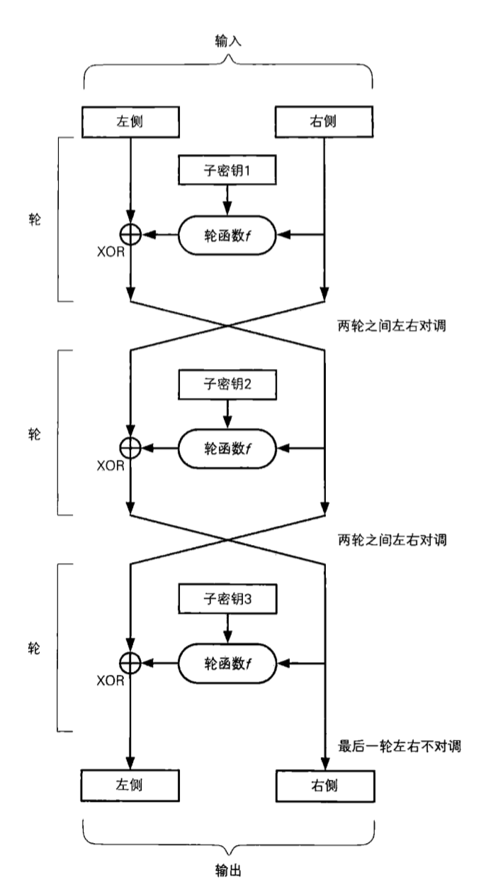

[TOC]

# DES

DES是一种将64比特的明文加密成64比特密文的对称密码算法，它的密钥长度为56bits，由于每隔7比特，增加一个校验位，DES密钥从规格上来说是64比特。

DES以64比特为一个分组进行加密，它是分组密码的一种。

## 加密与解密

## DES的结构

DES的基本结构是Feistel网络，加密的各个步骤称为轮，下图为Feistel三轮加密。

总结一轮加密的步骤：

(1) 将输入数据等分为左右两部分

(2) 输入的右侧直接发送到输出的右侧

(3) 输入的右侧发送到轮函数

(4) 轮函数根据右侧和子密钥计算出一串看上去为随机的比特序列

(5) 将(4)中结果与输入的左侧进行异或运输，运算结果作为输出的左侧。

## 子密钥生成过程

(1)PC-1密钥置换函数

由表可知，初始密钥的校验位被去掉，剩余的56位按上表的排列方式：第57位在第1位，第49位在第2位。经过密钥置换函数后，将置换输出分为28位C0和D0两部分，分别循环左移1位得到C1和D1，将两部分合并为56位，然后经过PC-2变换之后生成48位子密钥K1。

依次类推，直到生成子密钥K16，但每轮循环移位的位数有如下规定。

## 加密过程

### 加密详解

1. 初始置换：64位明文串经过一个置换函数IP，置换后得到64位输出，分为32位L0和32位R0

2. R0与子密钥K1经过密码函数变换F(R0,K1)得到32位输出，32位输出与L0异或，结果赋给R1，R0原封不动赋给L1。依次类推，最后生成L16和R16
3. 末置换：L16和R16经过末置换函数得到64位密文输出

### 密码变换函数F

密码变换函数F接受两个输入：32位数据和48位子密钥，输出结果为32位。具体运算如下：

扩展置换：32位数据通过扩展置换（重复某些位），得到48位输出

扩展置换得到的E与K进行异或得到48位数据，将48位数据分成B1 ~ B8组，经过S盒代替得到最终输出

S盒代替：S盒是一个4行16列的二维数组，每个元素值是16以内的整数。DES设计了8个不同的S盒。

假设6位输入为b1b2b3b4b5b6，则b1b6确定代替的行号,b2b3b4b5确定代替的列号

S盒1

| 14   | 4    | 13   | 1    | 2    | 15   | 11   | 8    | 3    | 10   | 6    | 12   | 5    | 9    | 0    | 7    |
| ---- | ---- | ---- | ---- | ---- | ---- | ---- | ---- | ---- | ---- | ---- | ---- | ---- | ---- | ---- | ---- |
| 0    | 15   | 7    | 4    | 14   | 2    | 13   | 1    | 10   | 6    | 12   | 11   | 9    | 5    | 3    | 8    |
| 4    | 1    | 14   | 8    | 13   | 6    | 2    | 11   | 15   | 12   | 9    | 7    | 3    | 10   | 5    | 0    |
| 15   | 12   | 8    | 2    | 4    | 9    | 1    | 7    | 5    | 11   | 3    | 14   | 10   | 0    | 6    | 13   |

S盒2

| 15   | 1    | 8    | 14   | 6    | 11   | 3    | 4    | 9    | 7    | 2    | 13   | 12   | 0    | 5    | 10   |
| ---- | ---- | ---- | ---- | ---- | ---- | ---- | ---- | ---- | ---- | ---- | ---- | ---- | ---- | ---- | ---- |
| 3    | 13   | 4    | 7    | 15   | 2    | 8    | 14   | 12   | 0    | 1    | 10   | 6    | 9    | 11   | 5    |
| 0    | 14   | 7    | 11   | 10   | 4    | 13   | 1    | 5    | 8    | 12   | 6    | 9    | 3    | 2    | 15   |
| 13   | 8    | 10   | 1    | 3    | 15   | 4    | 2    | 11   | 6    | 7    | 12   | 0    | 5    | 14   | 9    |

S盒3

| 10   | 0    | 9    | 14   | 6    | 3    | 15   | 5    | 1    | 13   | 12   | 7    | 11   | 4    | 2    | 8    |
| ---- | ---- | ---- | ---- | ---- | ---- | ---- | ---- | ---- | ---- | ---- | ---- | ---- | ---- | ---- | ---- |
| 13   | 7    | 0    | 9    | 3    | 4    | 6    | 10   | 2    | 8    | 5    | 14   | 12   | 11   | 15   | 1    |
| 13   | 6    | 4    | 9    | 8    | 15   | 3    | 0    | 11   | 1    | 2    | 12   | 5    | 10   | 14   | 7    |
| 1    | 10   | 13   | 0    | 6    | 9    | 8    | 7    | 4    | 15   | 14   | 3    | 11   | 5    | 2    | 12   |

S盒4

| 7    | 13   | 14   | 3    | 0    | 6    | 9    | 10   | 1    | 2    | 8    | 5    | 11   | 12   | 4    | 15   |
| ---- | ---- | ---- | ---- | ---- | ---- | ---- | ---- | ---- | ---- | ---- | ---- | ---- | ---- | ---- | ---- |
| 13   | 8    | 11   | 5    | 6    | 15   | 0    | 3    | 4    | 7    | 2    | 12   | 1    | 10   | 14   | 9    |
| 10   | 6    | 9    | 0    | 12   | 11   | 7    | 13   | 15   | 1    | 3    | 14   | 5    | 2    | 8    | 4    |
| 3    | 15   | 0    | 6    | 10   | 1    | 13   | 8    | 9    | 4    | 5    | 11   | 12   | 7    | 2    | 14   |

S盒5

| 2    | 12   | 4    | 1    | 7    | 10   | 11   | 6    | 8    | 5    | 3    | 15   | 13   | 0    | 14   | 9    |
| ---- | ---- | ---- | ---- | ---- | ---- | ---- | ---- | ---- | ---- | ---- | ---- | ---- | ---- | ---- | ---- |
| 14   | 11   | 2    | 12   | 4    | 7    | 13   | 1    | 5    | 0    | 15   | 10   | 3    | 9    | 8    | 6    |
| 4    | 2    | 1    | 11   | 10   | 13   | 7    | 8    | 15   | 9    | 12   | 5    | 6    | 3    | 0    | 14   |
| 11   | 8    | 12   | 7    | 1    | 14   | 2    | 13   | 6    | 15   | 0    | 9    | 10   | 4    | 5    | 3    |

S盒6

| 12   | 1    | 10   | 15   | 9    | 2    | 6    | 8    | 0    | 13   | 3    | 4    | 14   | 7    | 5    | 11   |
| ---- | ---- | ---- | ---- | ---- | ---- | ---- | ---- | ---- | ---- | ---- | ---- | ---- | ---- | ---- | ---- |
| 10   | 15   | 4    | 2    | 7    | 12   | 9    | 5    | 6    | 1    | 13   | 14   | 0    | 11   | 3    | 8    |
| 9    | 14   | 15   | 5    | 2    | 8    | 12   | 3    | 7    | 0    | 4    | 10   | 1    | 13   | 11   | 6    |
| 4    | 3    | 2    | 12   | 9    | 5    | 15   | 10   | 11   | 14   | 1    | 7    | 6    | 0    | 8    | 13   |

S盒7

| 4    | 11   | 2    | 14   | 15   | 0    | 8    | 13   | 3    | 12   | 9    | 7    | 5    | 10   | 6    | 1    |
| ---- | ---- | ---- | ---- | ---- | ---- | ---- | ---- | ---- | ---- | ---- | ---- | ---- | ---- | ---- | ---- |
| 13   | 0    | 11   | 7    | 4    | 9    | 1    | 10   | 14   | 3    | 5    | 12   | 2    | 15   | 8    | 6    |
| 1    | 4    | 11   | 13   | 12   | 3    | 7    | 14   | 10   | 15   | 6    | 8    | 0    | 5    | 9    | 2    |
| 6    | 11   | 13   | 8    | 1    | 4    | 10   | 7    | 9    | 5    | 0    | 15   | 14   | 2    | 3    | 12   |

S盒8

| 13   | 2    | 8    | 4    | 6    | 15   | 11   | 1    | 10   | 9    | 3    | 14   | 5    | 0    | 12   | 7    |
| ---- | ---- | ---- | ---- | ---- | ---- | ---- | ---- | ---- | ---- | ---- | ---- | ---- | ---- | ---- | ---- |
| 1    | 15   | 13   | 8    | 10   | 3    | 7    | 4    | 12   | 5    | 6    | 11   | 0    | 14   | 9    | 2    |
| 7    | 11   | 4    | 1    | 9    | 12   | 14   | 2    | 0    | 6    | 10   | 13   | 15   | 3    | 5    | 8    |
| 2    | 1    | 14   | 7    | 4    | 10   | 8    | 13   | 15   | 12   | 9    | 0    | 3    | 5    | 6    | 11   |

P置换

| z     | 1    | 2    | 3    | 4    | 5    | 6    | 7    | 8    | 9    | 10   | 11   | 12   | 13   | 14   | 15   | 16   |
| ----- | ---- | ---- | ---- | ---- | ---- | ---- | ---- | ---- | ---- | ---- | ---- | ---- | ---- | ---- | ---- | ---- |
| πP(z) | 16   | 7    | 20   | 21   | 29   | 12   | 28   | 17   | 1    | 15   | 23   | 26   | 5    | 18   | 31   | 10   |

| z     | 17   | 18   | 19   | 20   | 21   | 22   | 23   | 24   | 25   | 26   | 27   | 28   | 29   | 30   | 31   | 32   |
| ----- | ---- | ---- | ---- | ---- | ---- | ---- | ---- | ---- | ---- | ---- | ---- | ---- | ---- | ---- | ---- | ---- |
| πP(z) | 2    | 8    | 24   | 14   | 32   | 27   | 3    | 9    | 19   | 13   | 30   | 6    | 22   | 11   | 4    | 25   |

## DES算法安全性

* 所有的S盒都是固定的
* S盒的设计准则并未完全公开