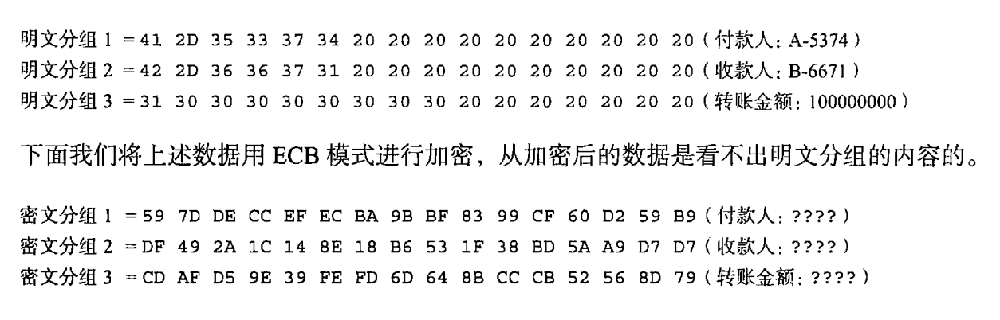

[TOC]

# 分组密码

**分组密码**是每次只能处理特定长度的一块数据的一类密码算法。这里的“一块”就称为分组（block）。此外一个分组的比特数就称为分组长度(block length)

DES、AES都是分组密码，DES的分组长度为64比特，AES的分组长度可以为128比特、192比特以及256比特。

流密码是对数据流进行连续处理的一类密码算法。

# 模式

分组密码算法只能加密固定长度的分组，但是一般需要加密的明文长度会超过分组密码的分组长度，这时需要对分组密码算法进行迭代，迭代的方式称为模式。

分组密码的主要模式有以下5种：

* ECB模式：Electronic CodeBook mode（电子密码本模式）

* CBC模式：Ciper Block Chaining mode（密码分组链接模式）

* CFB模式：Ciper FeedBack mode（密文反馈模式）

* OFB模式：Output FeedBack mode（输出反馈模式）

* CTR模式：Counter mode（计数器模式）

   

##ECB模式

在ECB模式中，将明文分组加密之后的结果直接成为密文分组：

ECB模式加密：

ECB模式解密：

###ECB模式的特点

ECB模式中，明文分组与密文分组是一一对应关系。因此，明文中有多个相同的明文分组，则这些明文分组最终都被转换为相同的密文分组。只要观察密文，就可以知道明文中重复的组合。

### 对ECB模式的攻击

ECB模式中，每个明文分组都独立地进行加密和解密，是一个很大的弱点，攻击者可以无需破译密码直接操纵明文。

攻击例子：

如果攻击者只是对密文分组进行对调

## CBC模式

EBC模式只是对密文进行简单的加密，CBC模式在加密前进行了异或运算。每次加密前会随机产生一个初始化向量。

CBC模式加密：

CBC模式解密：

### CBC模式的特点

* 在CBC模式中，我们无法单独对一个分组进行加密如果要得到密文分组3，必须凑齐明文分组1、2、3.
* CBC模式解密时，若有一个密文分组损坏，解密时最多只有两个明文分组受到数据损坏的影响。

### 对CBC模式的攻击

主动攻击者的目的是通过修改密文来操纵解密后的明文。如果主动攻击者能对初始化向量中的某个比特进行反转，则明文分组中相应的比特也会反转。

## CFB模式

在ECB和CBC模式中，明文分组都是通过加密算法加密的，而在CFB模式中，密文并没有通过加密算法直接进行加密。

CFB模式加密：

CFB模式解密：

### CFB模式与流密码

一次密码本是通过讲明文与密文进行XOR运算生成的。CFB算法则是明文与密码算法输出进行XOR运算生成的。两者在这一点上很相似。

在CFB模式中，密码算法的输出相当于密钥流，密码算法则相当于产生密钥流的伪随机数生成器。

CFB模式中，明文可以逐比特进行加密，可以将CFB模式看作一种使用`分组密码来实现流密码`的方式

### 对CFB模式的攻击

重放攻击

## OFB模式

OFB模式加密：

OFB模式解密：

### OFB模式与CFB模式

OFB模式与CFB模式加密的区别仅在于密码算法的输入。CFB模式是对密文进行反馈的，因此加密时必须按明文顺序进行加密。而在OFB模式中，可以事先通过密码算法生成密钥流。

## CTR模式

CTR模式加密

CTR模式解密：

### CTR与OFB模式

两者都属于流密码，加密解密形式完全一样，编程易实现

