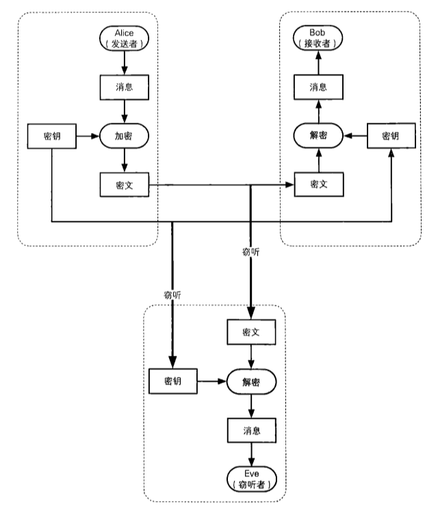

[TOC]

# 公钥密码

在对称密码中，由于加密和解密的密钥是相同的，因此必须向接收者配送密钥。这一问题称为`密钥配送问题`。如果使用公钥密码，则无需向接收者配送密钥，解决了密钥配送问题。

公钥密码：用公钥加密，私钥解密。

## 密钥配送问题

使用对称加密时，一定会遇到密钥配送问题。例如A使用对称密码加密信息发给B，**只有将密钥同时发给B，B才能解密**。但同时配送密钥，窃听者也能获得密钥进行解密。**密钥既需要发送，但又不能发送，这就是密钥配送问题**。

### 解决密钥配送问题

* 事先共享密钥 ： 有效，但有局限性
* 密钥分配中心（注意密钥分配中心工作流程）：若通信人员过多，密钥分配中心负荷大，并且若密钥分配中心被攻击，后果十分严重
* Diffie-Hellman密钥交换：后续探讨
* 公钥密码

## 公钥密码

公钥密码（public-key cryptography）中，密钥分为加密密钥和解密密钥。

* 发送者只需要加密密钥
* 接收者只需要解密密钥
* 解密密钥不可以被攻击者获取
* 加密密钥即使被获取也没有关系

公钥和私钥统称为密钥对（key pair）。密钥对中的两个密钥之间具有非常密切的关系，不能分别单独生成。公钥密码使用者需要生成一个包括公钥和私钥的密钥对，其中公钥会被发送给别人，而私钥仅供自己使用。

### 公钥密码通信流程

## RSA

RSA是一种广泛应用的公钥密码算法。

### RSA加密

$$
密文 = 明文^E mod N
$$

RSA的加密是求明文的E次方模N，因此只需要知道(E,N)，就可以完成加密，E和N的组合就是公钥。一般写作`公钥(E,N)`

### RSA解密

$$
明文 = 密文^D mod N
$$

RSA的解密就是密文的D次方模N，因此只需要知道(D,N)，就可以完成解密，D和N的组合就是私钥。一般写作`私钥(D,N)`。

RSA加密和解密的过程：

### 生成密钥对

* 求N
* 求L（L是仅在生成密钥对的过程中使用）
* 求E
* 求D

#### 求N

准备两个非常大的质数p，q。p，q太小的话，密码很容易破译。
$$
N = p * q
$$
为什么需要p，q相乘，回答这个问题需要数学知识，这里省略。

#### 求L

L是p - 1,q - 1的最小公倍数(least common multiple,lcm)
$$
L = lcm(p - 1,q - 1)   (L是p - 1,q - 1的最小公倍数)
$$

#### 求E

1 < E < L，此外E和L的最大公约数(greatest common divisor,gcd)必须为1
$$
1 < E < L
$$

$$
gcd(E,L) = 1      E和L的最大公约数为1（E和L互质，保证一定存在D）
$$

#### 求D

D，E和L之间具备下列关系
$$
1 < D < L
$$

$$
E * D mod L = 1
$$

### 小结密钥生成

### 密钥生成实例

(1)求N，准备两个质数17,19

N = 17 * 19 = 323

(2)求L

L = lcm(p - 1,q - 1) = lcm(16,18) = 144 (16和18的最小公倍数)

(3)求E

gcd(E,L) = 1，满足条件的有很多（注意，不全是质数，如25.但全是和144互质的数）

5,7,11,13,17,19,23,25,29,31,...，这里我们选5.

那么公钥：E = 5,N = 323

(4)求D

E * D mod L = 1

D = 29可以满足上述条件

E * D mod L = 5 * 29 mod 144 = 145 mod 144 = 1;

私钥:D = 29,N = 323；

| 公钥 | E = 5  | N = 323 |
| ---- | ------ | ------- |
| 私钥 | D = 29 | N = 323 |

### 加密

明文为123时
$$
明文^E mod N = 123^5 mod 323 = 225
$$
因此密文为225

###解密

$$
密文^E mod N =  225^29 mod 323 = 123
$$

### 对RSA的攻击

