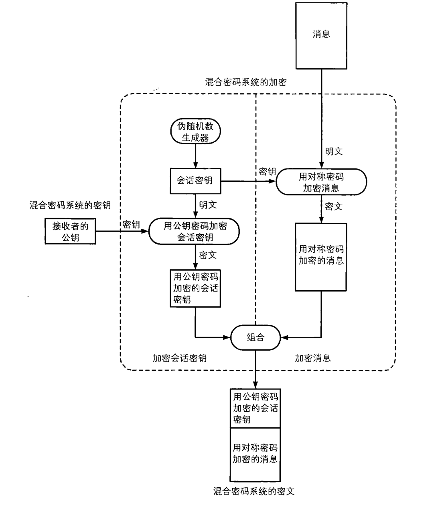
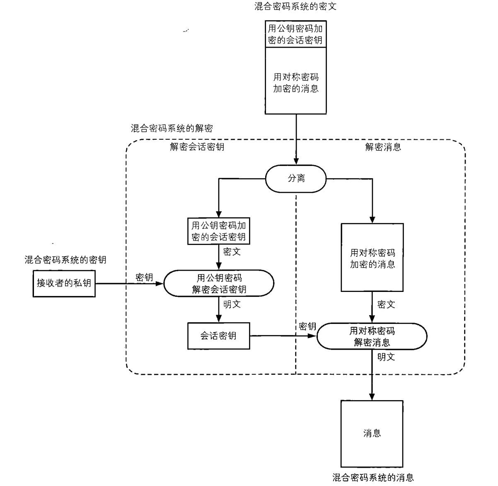

[TOC]

#混合密码系统

用对称密码加密消息，用公钥密码保护会话密钥。（对称密码加密消息提高速度，公钥密码解决密钥配送问题）

## 对称密码 vs 公钥密码

对称密码中存在密钥配送问题，公钥密码虽然解决了密钥配送问题，但公钥密码存在两个很大的问题。

（1）公钥密码的处理速度远远慢于对称密码

（2）公钥密码难以抵御中间人攻击

混合密码系统结合两者优点：

* 先用快速的对称密码对消息进行加密，保证消息的机密性
* 然后使用公钥密码对对称密码的密钥进行加密，保证对称密码密钥的机密性
* 由于密钥一般比消息短，因此公钥密码速度慢的问题可以被忽略。

##加密 &解密

混合密码系统加密

混合密码系统解密：

