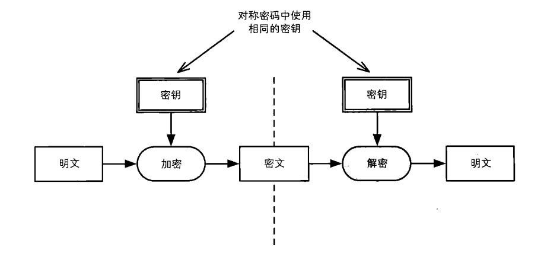
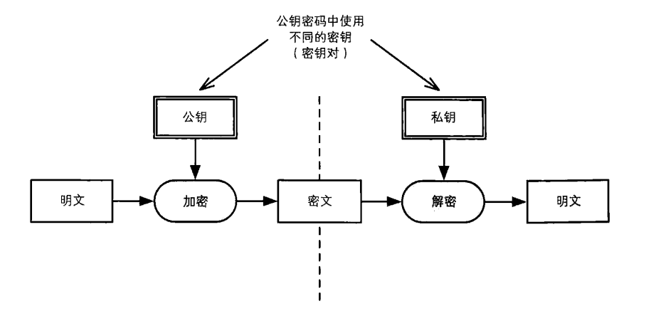
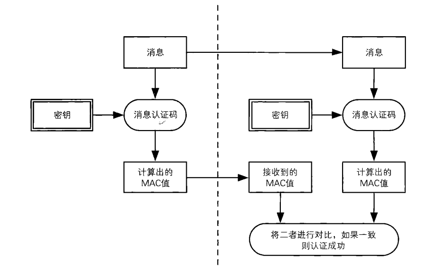
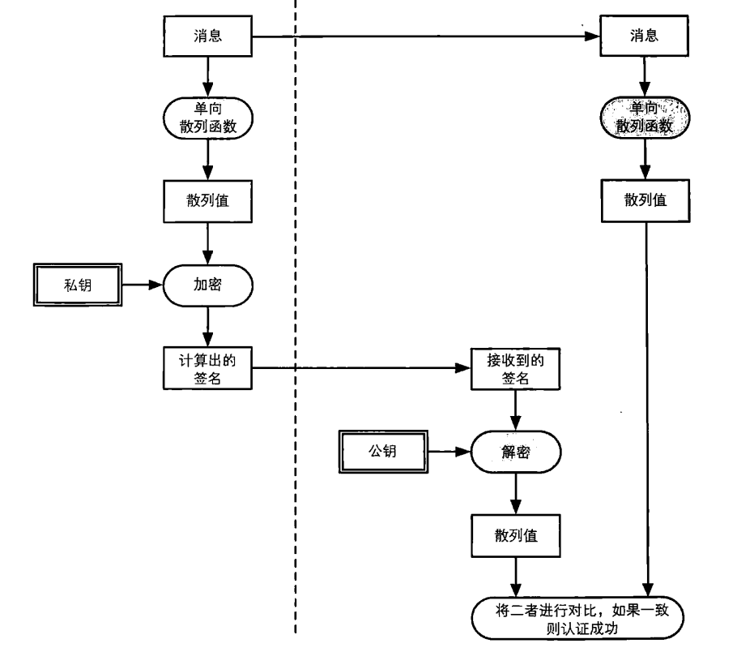
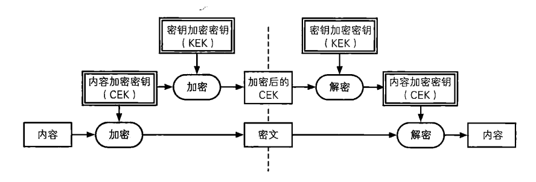
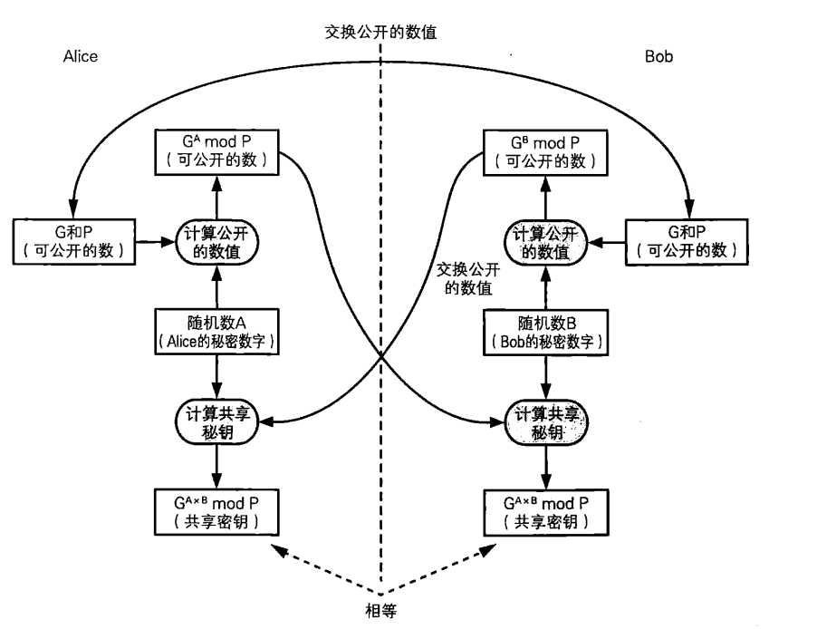
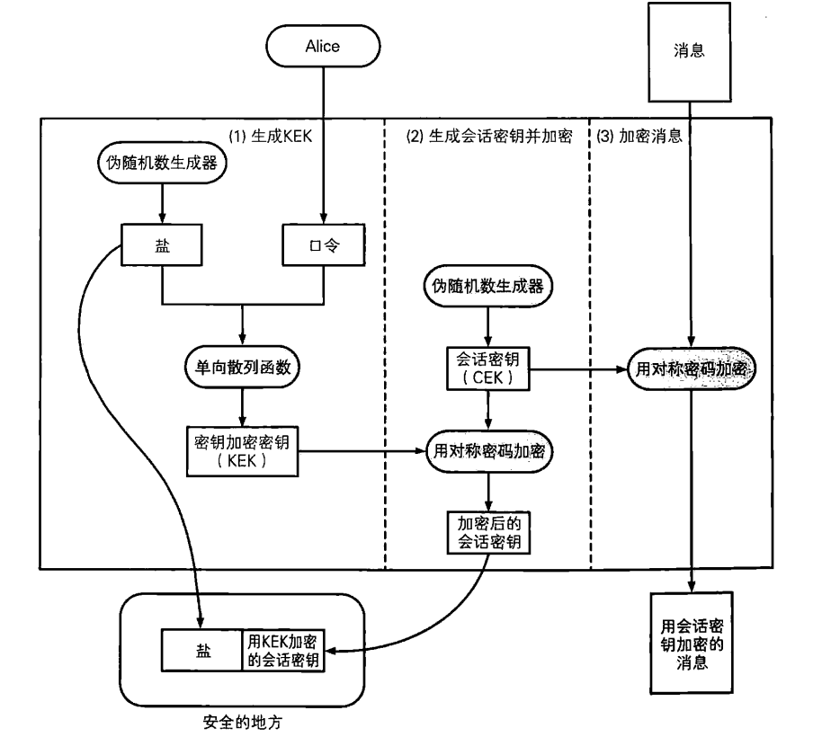
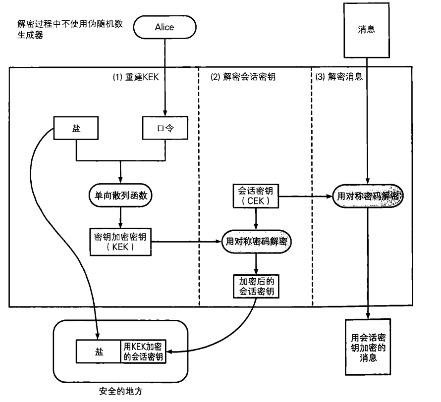
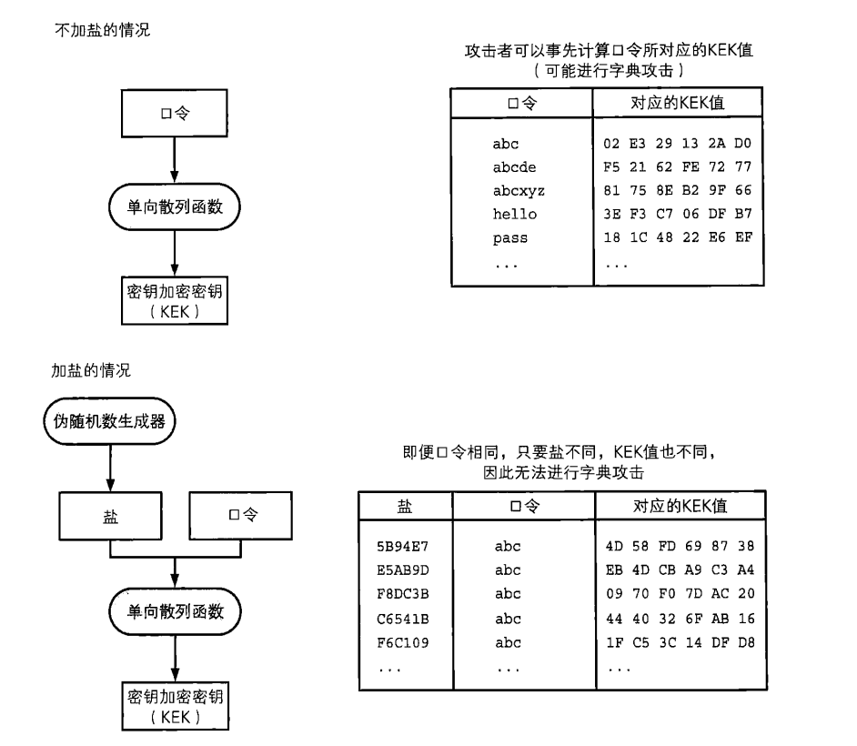

[TOC]

# 密钥

本章对下列知识进行整理

* 什么是密钥
* 各种不同的密钥
* 密钥的管理

在此基础上，还将学习下列关于密钥的知识

* Diffie-Hellman密钥交换
* 基于口令的密码
* 如何生成安全的口令


### 密钥就是一个巨大的数字

在使用对称密码、公钥密码、消息认证码、数字签名等密码技术时，都需要一个称为密钥的巨大数字。然后，**数字本身的大小并不重要，重要的是密钥空间的大小**。密钥空间的大小由**密钥长度**所决定。

* DES密钥
* AES密钥
* ……

### 密钥等价于明文

密钥的价值：A与B之间使用对称密码对明文进行加密，因为他们需要保密，而明文转化为密文库达到保密的目的，但如果密钥被攻击者获取，攻击者可以用密钥将密文转化为明文，对攻击者来说，得到密钥和明文是等价的。换言之，**密钥和明文是等价的**。


## 各种不同的密钥

### 对称密码的密钥与公钥密码的密钥

对称密码中，发送者和接收者共享密钥



公钥密码中：密钥对（公钥，私钥），公钥加密，私钥解密



### 消息认证码的密钥与数字签名的密钥

在消息认证码中，发送者和接收者使用**共享密钥**来进行认证。



在数字签名中，签名的生成和验证使用不同的密钥。只有持有私钥的本人才能够生成签名。但由于验证签名使用的是公钥，因此任何人都能够验证签名。




### 用于确保机密性的密钥与用于认证的密钥

对称密码和公钥密码的密钥都是用于保证机密性的密钥，如果不知道用于解密的合法密钥，就无法获取明文的内容。

相对地，消息认证码和数字签名所使用的密钥，则是用于认证的密钥。如果不知道合法的密钥，就无法篡改数据，也无法伪装成发送者本人。


### 会话密钥和主密钥

**会话密钥**（session key）：每次通信只使用一次的密钥，由于绘画密钥只在本次通信中有效，即使被攻击者获取，也只能破译本次通信的内容；虽然每次通信都会更换会话密钥，但如果用于生成密钥的伪随机数生成器品质不好，攻击者就有可能预测出下次生成的会话密钥。

**主密钥**（master key）：相对于会话密钥，一直被重复使用的密钥称为主密钥。


### 用于加密内容的密钥与用于加密密钥的密钥

一般来说，加密的对象是用户直接使用的信息，这样的情况下所使用的密钥称为CEK(Contents Encrypting Key 内容加密密钥)；相对地，用于加密密钥的密钥则称为KEY（Key Encrypting Key，密钥加密密钥）。



之前提到的会话密钥都是被作为CEK使用的，而主密钥则是被作为KEK使用的


## 密钥的管理

 ### 生成密钥

* 用随机数生成密钥：密码学用途的伪随机数生成器必须是专门针对密码学用途而设计的
* 用口令生成密码


### 密钥配送

* 事先共享密钥
* 密钥分配中心
* 公钥密码
* Diffie-Hellman密钥交换


### 更新密钥

密钥更新：在使用共享密钥进行通信的过程中，定期（例如每发送1000个字）改变密钥。在更新密钥事，发送者和接收者使用单向散列函数计算当前密钥的散列值，并将这个散列值用作新的密钥。也就是用**当前密钥的散列值作为下一个密钥**。

**后安全性（backward security）**：假设在通信的某个时间点上，密钥被窃听者获取了，那么窃听者就可以用这个密钥解密之后全部的通信内容。但是窃听者却无法解密更新密钥前的通信内容，因为这需要用单向散列函数的输出（即当前密钥）反算出单向散列函数的输入（上一个密钥）。由于单向散列函数具有单向性，因此保证了这样的反算很困难。这种防止破译过去通信内容的机制，称为后安全性。


### 保存密钥

* 人类无法记住具有实用长度的密钥

我们记不住密钥，但如果将密钥保存又可能会被窃取，我们可以考虑一些合理的解决方法。

* 将密钥保存成文件，并将这个文件保存在保险柜等安全的地方：但这样出门在外不方便使用
* **将密钥加密后保存**。当然，要加密就必然需要另一个密钥。像这样用于加密密钥的密钥，称为KEK。假如，计算机上由100万个密钥，如果我们用一个密钥KEK将这100万个密钥进行加密，那么只需保管这一个密钥，但是这一个KEK的价值相当于100万个密钥价值的总和


### 作废密钥

* 为什么要作废密钥？若A、B之间的通信密钥不再需要时，需要妥善删除。否则如果被窃听者获取，之前发送的加密邮件就会被解密。
* 如何作废密钥？若密钥是计算机软件上的一个文件，那么仅仅删除这个文件不足以删除密钥。要完全删除密钥，不但要找到密码软件，还需要在设计计算机系统时对信息安全进行充分的考虑。
* 密钥丢了怎么办？如果丢失对称密码的共享密钥，就无法解密密文；丢失消息认证码的密钥，就无法向通信对象证明自己的身份；公钥一般不太会发生丢失的情况；若丢失公钥密码的私钥，就无法解密公钥密码加密的密文；丢失数字签名的私钥，就无法生成数字签名。


## Diffie-Hellman密钥交换



(1) A向B发送两个质数P和G；P必须是一个非常大的质数，而G是一个和P相关的数，称为生成元（generator），G可以是一个娇小的数。

(2) A生成一个1 ～ P-2之间的整数，只有A自己知道

(3) B生成一个1 ～ P-2之间的整数，只有B自己知道

(4) A将G^A mod P 发送给B，可以被攻击者获得

(5) B将G^B mod P 发送给A，可以被攻击者获得

(6) A用B发过来的数计算共享密钥 = ( G^B mod P)^A mod P = G^(A*B) mod P

(7) B用A发过来的数计算共享密钥 = ( G^A mod P)^B mod P = G^(A*B) mod P

A计算的密钥 = B计算的密钥


### 具体实例

(1)两个质数 P = 13,G = 2(G是一个生成元)

(2) A生成一个随机数A = 9

(3) B生成一个随机数B = 7

(4) A将G^A mod P发送给B : `G^A mod P = 2^9 mod 13 = 5`

(5) B将G^B mod P发送给A：`G^B mod P = 2^7 mod 13 = 11`

(6) A计算密钥:`(G^B mod P)^A mod P = 11 ^ A mod 13 = 11 ^ 9 mod 13 = 8`

(7) B计算密钥:`(G^A mod P)^B mod P = 5 ^ B mod 13 = 5 ^ 7 mod 13 = 8`


## 基于口令的密码（PBE）

基于口令的密码（Password Based Encryption,PBE）就是一种根据口令生成密钥并用该密钥进行加密的方法。其中加密和解密使用同一个密钥。

PBE的意义可以按照下述逻辑来理解

```
想确保重要消息的机密性 -> 直接保存在磁盘，可能被人看到 -> 用密钥（CEK）对消息进行加密 -> 现在又需要确保CEK的机密性 -> 将CEK直接保存在磁盘上可能很危险 -> 用另一个密钥KEK对CEK加密吧 -> 等等，现在又需要确保KEK的机密性了。进入了死循环 -> 既然如此，那就用口令来生成密钥KEK吧 -> 但只用口令容易遭到字典攻击 -> 那么就用口令和盐共同生成KEK -> 盐可以和加密后的密钥CEK一起保存在磁盘上，而密钥KEK可以直接丢弃 -> 口令就记在自己脑子里吧
```


### PBE加密




(1)生成KEK

伪随机数生成器会生成一个被称为盐的随机数。将盐和口令一起输入单向散列函数，得到的散列值就是用来加密密钥的密钥（KEK）

(2)生成会话密钥并加密

会话密钥需要用到（1）生成的KEK进行加密，并和盐一起保存在安全的地方，会话密钥加密后，KEK就可以被丢弃，因为盐和口令就可以重建KEK

(3)加密消息

PBE加密后所产生的输出包括

* 盐
* 用KEK加密的会话密钥
* 用会话密钥加密的消息

盐和KEK加密的会话密钥需要保存在安全的地方

### PBE解密

(1)重建KEK

(2)解密会话密钥

(3)解密消息



### 盐的作用

**盐是用来预防字典攻击的**。字典攻击是一种事先计算并准备好候选密钥列表的方法

没有盐：主动攻击者在窃取加密的会话密钥前，就准备好了大量的候选KEK，窃取到加密的会话密钥后，利用事先生成的候选KEK尝试解密，能大量缩短尝试时间，这就是字典攻击。

加盐：盐的长度越长，候选KEK的数量也会随之增大，实现生成候选KEK会变得非常苦难。只要攻击者没有得到盐，就无法生成候选KEK




## 如何生成安全的口令

* 使用自己才能知道的信息
* 不要使用对自己重要的事物的名字
* 不要使用关于自己的信息
* 不要使用别人见过的信息
* 将多个不同的口令分开使用（登陆公司计算机的口令: abc1；邮件口令abc2;淘宝口令: abc3）这种做法不可取
* 有效利用笔记
* 理解口令的局限性

