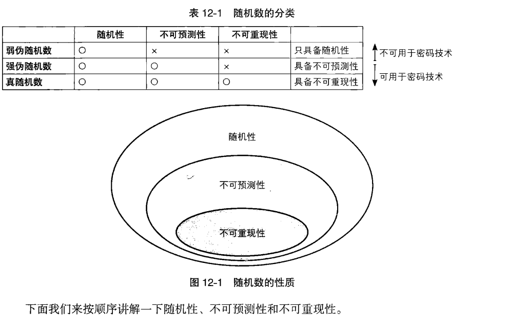
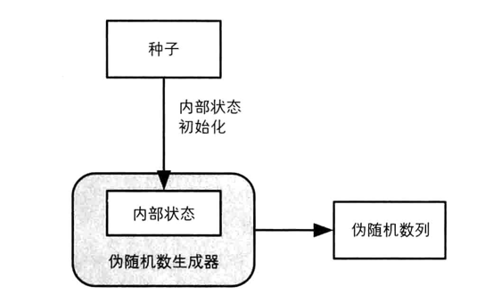
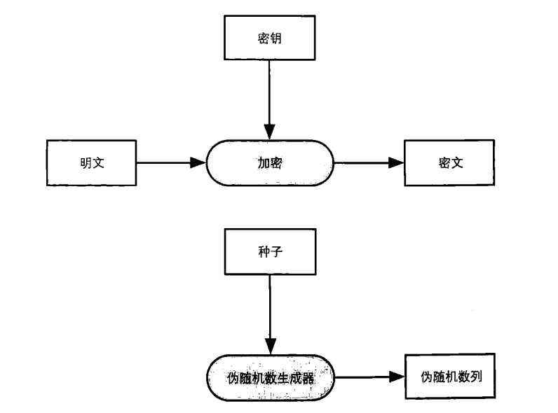
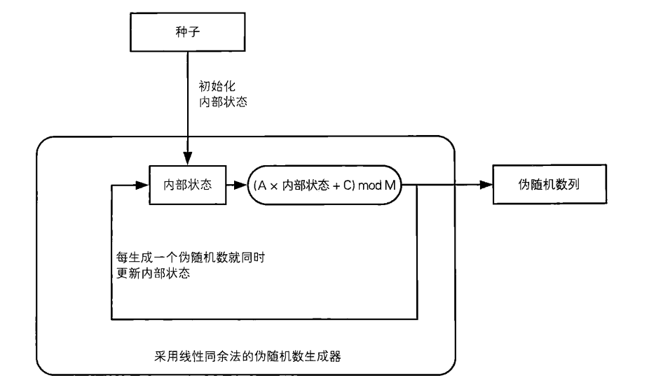
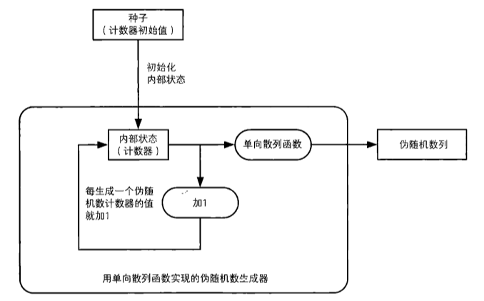
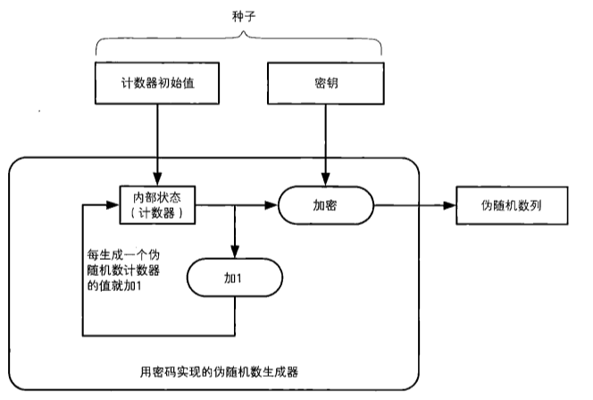
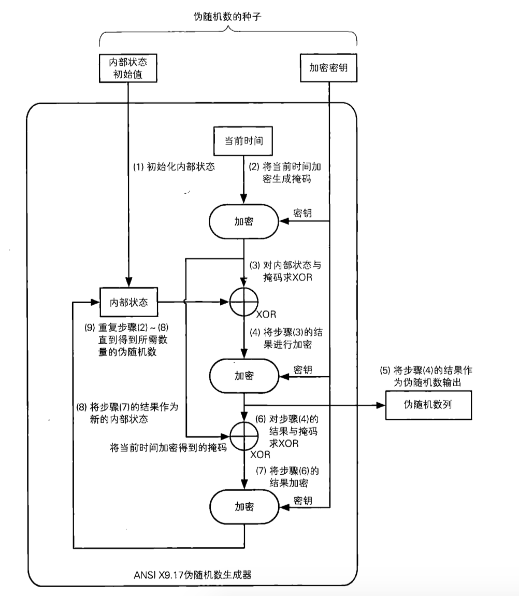

[TOC]

# 随机数

* 使用随机数的密码技术
* 随机数的性质
* 伪随机数生成器
* 具体的伪随机数生成器
* 对伪随机数生成器的攻击

##使用随机数的密码技术

* 生成密钥：对称密码&消息认证码
* 生成密钥对：公钥密码和数字签名
* 生成初始化向量(IV)：分组密码CBC、CFB和OFB模式
* 生成nonce：用于防御重放攻击以及分组密码的CTR模式
* 生成盐：用于基于口令的密码(PBE)等

## 随机数的性质

* 随机性 -- 不存在统计学偏差，是完全杂乱的数列
* 不可预测性 -- 不能从过去的数列推测出下一个出现的数
* 不可重现性 -- 除非将数列本身保存下来，否则不能重现相同的数列

## 伪随机数生成器

伪随机数生成器的结构

* 伪随机数生成器的内部状态：是指伪随机数生成器所管理的内存中的数值。当需要生成随机数是，伪随机数生成器会根据内存中的数值进行计算，将计算的结果作为输出。随后，为了响应下一个请求，伪随机数生成器会改变自己的内部状态。因此，**伪随机数生成算法 = 内部状态计算伪随机数的方法 + 改变内部状态的方法**；内部状态决定了下一个伪随机数，因此内部状态不能被攻击者知道
* 种子：种子用来初始化伪随机数生成器的内部状态的。种子是一串随机的比特序列，根据种子可以生成出专属于自己的伪随机数列。伪随机数生成器是公开的，但种子需要保密。类似于密码算法是公开的，但密钥必须保密。

## 具体的伪随机数生成器

* 杂乱的方法
* 线性同余法
* 单向散列函数法
* 密码法
* ANSI X9.17

### 杂乱的方法

既然要生成杂乱的数列，使用杂乱的算法不就可以了吗？周期太短，算法杂乱，程序员不能理解算法的详细内容，无法判断所生成的随机数是否具有不可预测性

### 线性同余法

这是很广泛使用的伪随机数生成器算法，然而并不能用于密码技术。

假设伪随机数列：R0、R1、R2、……

R0 = （A X 种子 + C）mod M （A、C、M都是常量，且A和C小雨M）

R1 = （A X R0 + C）mod M	

……

Rn = （A X Rn-1 + C）mod M

* 实例 ： A = 3、C = 0、M = 7、seed = 6

R0 = (3 * 6) mod 7 = 4 、R1 = (3 * 4) mod 7 = 4 ……

以此类推，可以得到4、5、1、3、2、6、4、5、1、3、2、6……在这里4、5、1、3、2、6不断循环，因此周期为6。

然而线性同余法不具备不可预测性，因此**不可以将线性同余法用于密码技术**。

可以很容易证明不具备不可预测性，假设攻击者已经知道`A = 3、C = 0、M = 7`。这时他只需要得到所生成的伪随机数中的任意一个，就可以预测下一个伪随机数。

### 单向散列函数法

使用单向散列函数（如SHA-1）可以编写出具备不可预测性的伪随机数列

(1)用种子初始化内部状态（计数器）

(2)用单向散列函数计算计数器的散列值

(3)将散列值作为伪随机数输出

(4)计数器+1

不可预测性：攻击者要预测下一个伪随机数，需要知道计数器的当前值，这里的输出是单向散列函数的值。也就是说要知道计数器的值必须破解单向散列函数的单向性。

### 密码法

使用密码法来编写伪随机数生成器，既可以使用AES对称密码，也可以使用RSA等公钥密码

(1)初始化内部状态(计数器)

(2)用密钥加密计数器的值

(3)将密文作为伪随机数的输出

(4)计数器+1

不可预测性：攻击者要预测下一个伪随机数，需要知道计数器的当前值，然而，由于之前所输出的伪随机数列相当于密文，要知道计数器的值必须破译密码。

### ANSI X9.17

ANSI X9.17伪随机数生成器的构造如图

(1)初始化内部状态

(2)将当前时间加密生成掩码

(3)将内部状态与掩码异或

(4)将(3)的结果加密

(5)将(4)的结果作为伪随机数输出

(6) (4)的结果与掩码异或

(7) 将(6)的结果加密

(8)将(7)作为新的内部状态

## 对伪随机数生成器的攻击

* 对种子进行攻击
* 对随机数池进行攻击：一般不会到了需要的时候才生成真随机数，而是会在一个名为随机数池的文件中积累随机比特序列，当需要伪随机数种子时，从这里去除。随机数池的内容不可以被攻击者知道，否则随机数种子就可以被预测出来

