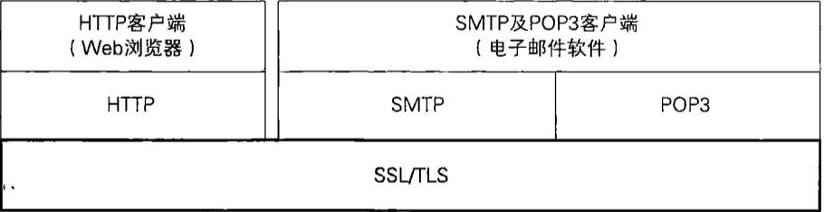
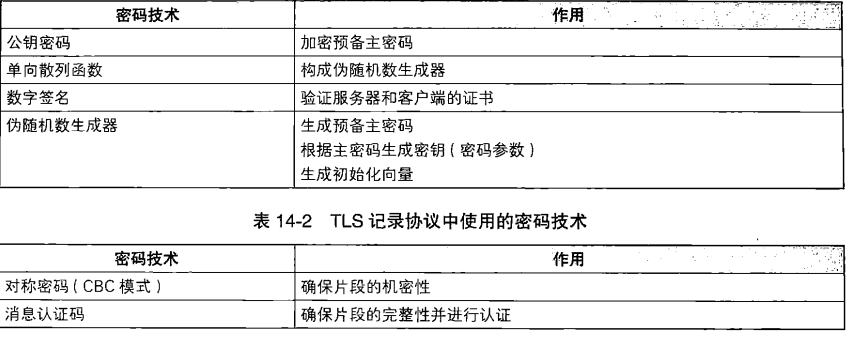

[TOC]

# SSL/TLS

SSL(Secure Socket Layer)/TLS(Transport Layer Security)是世界上应用最广泛的密码通信方法。当在网上商城中输入信用卡号时，我们的Web浏览器就会使用SSL/TLS进行密码通信。使用SSL/TLS可以对通信对象进行认证，还可以确保通信内容的机密性。

## case study

以A在B的网店买书为例，此时A希望通过浏览器向B的书店发送信用卡号，有几个必须解决的问题

(1) A的信用卡号和地址发送到B的书店的过程中不能被窃听（**机密性问题**）

(2) A的信用卡号和地址发送到B的书店的过程中不能被篡改（**完整性问题**）

(3) 确认通信对方的Web服务器是真正的Web服务器（**认证问题**）

solution：

为了保证**机密性**，可以采用对称密码，由于对称密码的密钥不能被攻击者预测，使用**伪随机数生成器**来生成密钥。若要将对称密码的密钥发送给B，可以使用**公钥密码**或者**Diffie-Hellman密钥交换**

要识别**篡改**，对数据进行**认证**，可以使用消息认证码。消息认证码是通过**单向散列函数**来实现的。

要对通信对象进行认证，可以使用**数字签名**。

**SSL/TLS**就是一个将这些方式组合起来的框架。

### SSL/TLS也可以保护其他协议

## 使用SSL/TLS通信

本节内容基于TLS1.0编写，如对技术细节不感兴趣，可以略过

@书P327 ～ 339

## 对SSL/TLS的攻击

* 对各个密码技术的攻击
* 对伪随机数生成器的攻击
* 利用证书的时间差进行攻击

## 使用的注意事项

* 密码通信之前的数据不受保护
* 密码通信之后的数据不受保护

