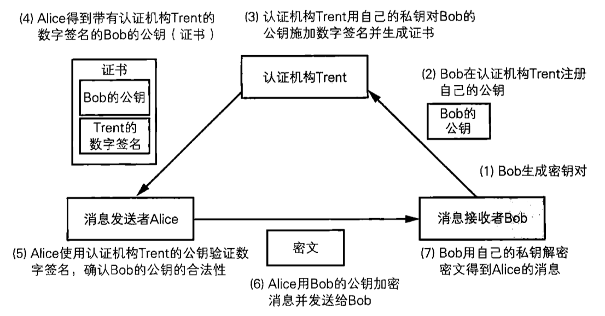
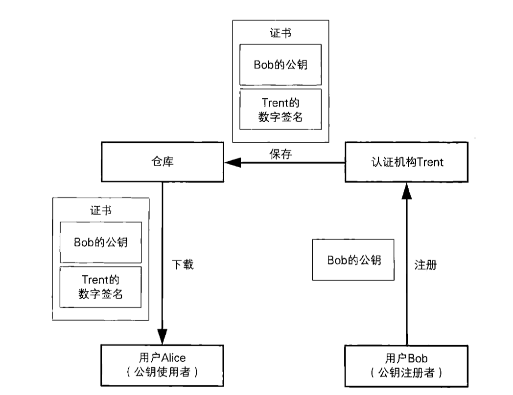
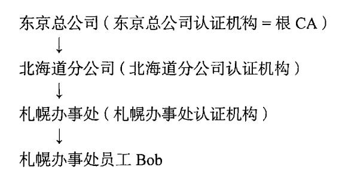
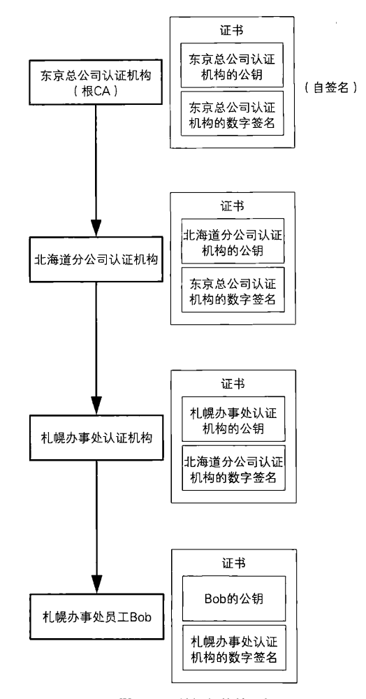
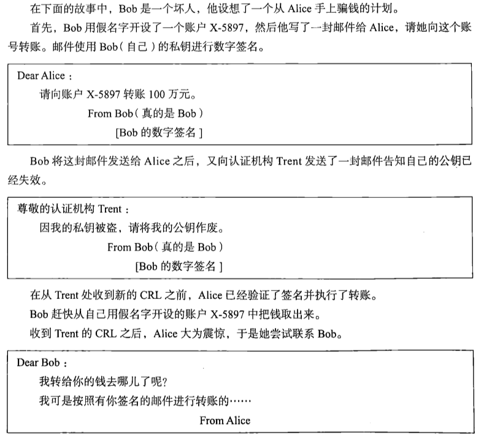
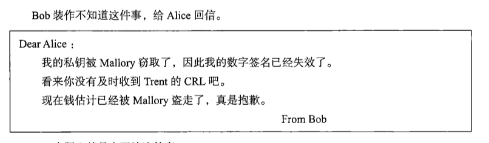

[TOC]

# 证书 - 为公钥加上数字签名

**公钥证书(Public-key Certificate,PKC)**其实和驾照很相似，里面记有姓名、组织、邮箱地址等个人信息以及属于此人的公钥，并由**认证机构(Certification Authority,CA)**施加数字签名。

### 证书的应用场景

(1)Bob生成密钥对(公钥,私钥)

(2)Bob在认证机构Trent注册自己的公钥：第5章中Bob直接将公钥发给Alice，但这里发给了认证机构，请认证机构对他的公钥加上数字签名，也就是生成证书（认证机构收到Bob的公钥后，会确认所收到的公钥是否为Bob本人所有：例如VerSign机构会通过邮箱确认、第三方数据库确认、当面认证等）。

(3)认证机构对Bob的公钥施加数字签名并颁发证书

(4)A得到带有认证机构的数字签名的Bob的公钥

(5)A使用认证机构的公钥验证数字签名，确认B公钥的合法性

(6)A验证成功后用Bob的公钥加密消息发给B

(7)B用私钥解密消息

### 证书的内容

证书由认证机构颁发，使用者对证书进行验证。最广泛的证书规范标准是由ITU和ISO制定的X.509规范。X.509规范大体上包含以下3部分内容

* 签名签的证书：签名对象的信息
* 数字签名算法
* 数字签名：对证书施加数字签名

## 公钥基础设施(PKI)

仅制定证书的规范还不足以支持公钥的实际运用，我们还需要其他的很多规范，例如证书应该由谁来颁发，如何颁发，私钥泄露时如何作废证书，计算机之间的数据交换应采用怎样的格式等

### 什么是公钥基础设施

**公钥基础设施(Public-Key Infrastructure)**是为了能够更有效地运用公钥而制定的一系列规范和规格的总称，一般简写为PKI

### PKI的组成要素

* 用户  -- 使用PKI的实体（人、计算机等）
* 认证机构 -- 颁发证书的人
* 仓库 -- 保存证书的数据库

（1）用户 -- 用户包括两种：希望使用PKI注册自己公钥的实体；另一种是希望使用已注册的公钥的人。

【注册公钥用户需要进行的操作】

* 生成密钥对（也可以由认证机构生成）
* 在认证机构注册公钥
* 向认证机构申请证书
* 根据需要作废已注册的公钥
* 解密接受的密文
* 对消息进行数字签名

【使用已注册公钥的用户的操作】

* 将消息加密后发送给接收者
* 验证数字签名

（2）认证机构

* 生成密钥对：用户自己生成或者由认证机构生成（由认证机构生成用户密钥对是，认证机构需要将密钥发送给用户，需要使用一些规范）
* 注册证书：对用户的身份进行确认，并生成证书（使用认证机构的私钥来进行数字签名）
* **作废证书与CRL**(Certificate Revocation List)：认证机构作废证书时即便从仓库删除也不行，因为用户会保存证书的副本，因此，认证机构需要制作一张证书作废清单CRL。CRL是一张已经作废的证书序列号的清单，并由认证机构加上数字签名。**PKI用户需要从认证机构获取最新的CRL，并查询自己使用的公钥证书是否有效**。

### 证书的层级结构

认证机构对用户的公钥进行数字签名并生成证书。认证机构的公钥如何验证？对于认证机构的公钥，可以由其他认证机构施加数字签名。以此类推，形成证书的层级结构。重点一般称为根CA，由自己颁发证书，称为**自签名（self-signature）**

例如A需要验证Bob的数字签名：流程如下

## 对证书的攻击

* 在公钥注册前攻击：B生成密钥对，准备注册，攻击者将密钥替换成自己的，这样认证机构会对（B的信息，攻击者的公钥）进行签名
* 注册相似人名进行攻击
* 窃取认证机构的私钥，攻击者就可以以认证机构的身份给自己颁发证书
* 伪装成认证机构：说明**如果认证机构本身不可信，即使证书合法，其中的公钥也不能使用**
* 钻CRL的空子进行攻击：公钥失效到用户收到CRL需要经过一段时间，攻击者可以利用CRL发布的时间差来发动攻击的。
* 虽然数字签名可以防止否认，但通过钻CRL的空子，就有可能实现否认

Bob实际上就是在否认。

