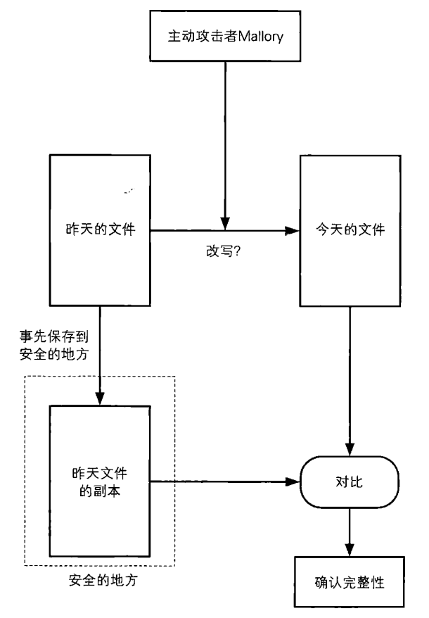

[TOC]

# 单向散列函数

在刑事侦查中，指纹经常被用到。通过将某个特定人物的指纹与现场遗留的指纹进行对比，即可知道该人物与案件是否存在关联。

当需要比较两条消息是否一致时，我们不必直接对比消息本身的内容，对比它们的“指纹”即可。


## 什么是单向散列函数

###场景：确认文件的完整性


方法一：关闭前把文件拷贝到一个安全的地方保存起来，第二天在使用文件签，先将其和事先保存的文件进行对比即可。但如下图所示的确认完整的方法实际上是毫无意义的。如果可以事先把文件保存在一个安全的地方，那么就根本不需要确认完整性，直接用事先保存的文件就可以。此外，这种方法还存在效率问题，例如文件非常巨大，那么文件的拷贝、保存以及比较都是非常耗时的。



f

方法二：提取文件的“**指纹**”   ： 散列值


单向散列函数（one-way hash function）有一个输入和一个输出，其中输入称为消息（message），输出称为散列值。


### 单向散列函数的性质

* 根据任意长度的消息计算出固定长度的散列值（因为如果输入的长度越长，生成的散列值也越长的话，散列函数就不适合使用了）
* 能够快速计算出散列值：不能在现实时间内完成计算没有意义
* 消息不同散列值不同：为了确认完整性，消息中哪怕只有1比特发生改变，也必须有很高的概率产生不同的散列值，否则消息就会很容易被篡改。难以发现碰撞的性质称为抗碰撞性（collision resistance）
* 具备单向性，单向性是指无法通过散列值反算出消息的性质。


### 术语

单向散列函数也成为**信息摘要函数**（message digest function）、哈希函数。

输入单向散列函数的消息也称为**原像**(pre-image)

单向散列函数输出的散列值也称为**信息摘要(**message digest)或者**指纹**(fingerprint)

完整性也称为**一致性**。


### 单向散列函数的具体例子

* MD4、MD5，能够产生128比特的散列值，但抗碰撞性意境被攻破
* SHA-1、SHA-256、SHA-384、SHA-512
* RIPEMD-160
* AHS


## 单向散列函数SHA-1

SHA-1是一种能够根据上限为2^64 比特的消息计算出160比特的散列值的单向散列函数。

#### 整体流程

(1) 填充：对消息进行填充处理，使其长度为512比特（一个输入分组）的整数倍。

(2) 计算W0 ~ W79:根据输入分组的512比特计算出80个32比特的值(W0 ~ W79)

(3) 分组处理：对输入分组依次进行80个步骤的处理，计算5个32比特的值（A ~ E）作为SHA-1的内部状态。对所有分组都要进行这一操作。

(4)单步处理，分组处理是由80个步骤的处理组成的，其中每个步骤都是基于W0 ~ W79使内部状态进行复杂变化的处理


####例子

(1)填充

例如对`hello`这条长度为6字节的消息进行填充，ASCII码如下

```
01001000 01100101 01101100 01101100 01101111 00101110
```

(1.1)添加1

在消息末尾添加1，这样消息的长度就增加了1比特

```
01001000 01100101 01101100 01101100 01101111 00101110 1
```

(1.2)添加0

在消息末尾添加0，直到消息的长度达到512比特的整数倍，但是最后一个分组的最后64比特需要空出来以便保存原始消息的长度。

hello去掉用于保存消息长度的64比特后，还需要添加0直到消息的长度到达512 - 64 = 448比特

```
01001000 01100101 01101100 01101100 01101111 00101110 10000000 00000000 00000000 00000000
00000000 00000000 00000000 00000000 00000000
00000000 00000000 00000000 00000000 00000000
00000000 00000000 00000000 00000000 00000000
···
00000000 00000000 00000000 00000000 00000000
```

(1.3)添加消息长度

hello原始消息的长度为48比特，添加在消息末尾

```
01001000 01100101 01101100 01101100 01101111 00101110 10000000 00000000 00000000 00000000
00000000 00000000 00000000 00000000 00000000
00000000 00000000 00000000 00000000 00000000
00000000 00000000 00000000 00000000 00000000
···
00000000 00000000 00000000 00000000 00000000
00000000 00000000 00000000 00000000 00000000
00000000 00000000 00110000
```


(2)计算W0 ～ W79

这个值被用于(4) 单步处理中

* 将输入分组512比特分成32比特 * 16组，W0 ~ W15

* 剩下的W16 ~ W79的计算方法如下。

  

前两步计算如下：


(3)分组处理

接下来，对分组进行80个步骤的处理，目的是根据输入分组的信息来改变内部状态(160比特)。


160比特的内部状态是通过A、B、C、D、E的5个32比特缓冲区来反映的。这些缓冲区与刚才的W0～W79不同，通过上述80个步骤的反复执行，SHA-1就能够将已经过填充的全部消息混入这160比特的内部状态中

(4)单步处理

分组处理中提到的80步骤，每一步的详细过程如下图所示


## 对单向散列函数的攻击

* 暴力破解
* 生日攻击(试图破解单向散列函数的“强抗碰撞性”)