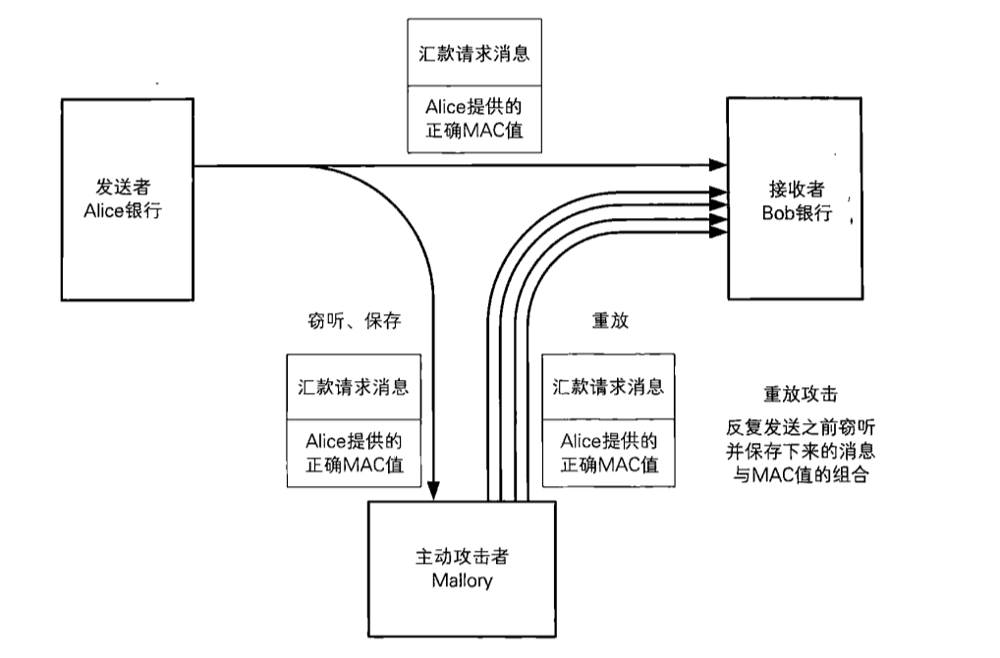

[TOC]

# 消息认证码

消息的认证（authentication）指的是“消息来自正确的发送者”这一性质，用于识别是否有人伪装成发送者发送了该消息

**消息认证码**(message authentication code)是一种确认完整性并进行认证的技术，简称为MAC。

```
消息认证码的输入包括任意长度的消息和一个发送者与接收者之间的共享密钥，它可以输出固定长度的数据即MAC值，这一点与单向散列函数类似。要计算MAC值，就必须持有共享密钥，消息认证码就是通过这一性质来完成认证的。
```

此外，和单向散列函数一样，消息变化1比特，MAC值也会产生变化。

暂且可以这样理解：**消息认证码是一种与密钥相关的单向散列函数**。


## 消息认证码的使用步骤

* 发送者与接收者事先共享密钥
* 发送者根据共享密钥计算出MAC值
* 发送者将消息和MAC值发送给接收者
* 接收者根据共享密钥计算MAC值
* 对比两个MAC值，如果一致，则认证成功，该消息来自期待的发送者。


## 消息认证码的密钥配送问题

发送者和接收者需要共享密钥，这一点与对称密码很相似。实际上，对称密码的密钥配送问题在消息认证码中耶同样会发生。需要解决密钥配送问题，可以使用一些共享密钥的方法

* 公钥密码
* Diffie-Hellman密钥交换
* 密钥分配中心
* 其他安全的方式


## 消息认证码的应用实例

* **SWIFT**（Society for Worldwide Interbank Financial Telecommunication），银行与银行之间通过这个来传递交易信息
* **IPsec**对IP协议增加安全的一种方式，在IPsec中，对通信内容的认证和完整性校验都是采用消息认证码来完成的
* **SSL/TLS**是在网上购物等场景中所使用的通信协议，它对通信内容的认证和完整性校验也使用了消息认证码。

## 消息认证码的实现方法

* 使用单向散列函数实现，其中一种是HMAC，下面会介绍
* 使用分组密码(DES,AES)实现：将分组密码的密钥作为消息认证码的密钥来使用，并用CBC模式将消息全部加密。由于消息认证码中不需要解密，只保留最后一个分组作为MAC值。由于CBC模式的最后一个分组会受到整个消息以及密钥的双重影响。因此可以作为消息认证码


* 其他方法：流密码和公钥密码也可以实现消息认证码


## HMAC

H(hash)MAC是一种使用单向散列函数来构造的消息认证码的方法。

### HMAC的步骤


（1）密钥填充

* 密钥长度 < 单向散列函数分组长度，末尾填充0，直到达到单向散列函数的分组长度
* 密钥长度 > 单向散列函数，单向散列函数求出密钥的散列值，然后将这个散列值作为HMAC的密钥


（2）填充后的与ipad异或

iPad是将00110110这一比特序列不断循环反复直到达到分组长度所形成的比特序列。

异或得到的结果，就是一个长度等于单向散列函数的分组长度，且和密钥相关的比特序列。称为ipadkey。

（3）与消息组合

随后将ipadkey附加在消息的开头

（4）计算散列值

将（3）的结果输入单向散列函数，并计算出散列值

（5）填充后的密钥与opad异或

Opad是将01011100这一比特序列不断循环反复直到达到的分组长度所形成的比特序列。

这里得到的结果也是一个长度等于单向散列函数的分组长度，且和密钥相关的比特序列。称为opadkey

（6）与散列值组合

将（4）的散列值拼在opad后面

（7）计算散列值

将6的结果输入单向散列函数，并计算出散列值。这个散列值就是最终的MAC值


## 对消息认证码的攻击

* 重放攻击：攻击者将实现保存的正确的MAC值不断重放来发动攻击。有几种方式可以防御重放攻击：序号、时间戳、nonce(通信前，发送一个一次性的随机数)




* 密钥推测攻击：暴力破解


## 消息认证码无法解决的问题

* 第三方证明：B在接收到A发送的消息后想向第三方C证明这条消息来自A，但用MAC不能实现。因为首先C要计算MAC值，需要知道双方的共享密钥，但即使计算出MAC，也无法判断是由A发出，也有可能由B发出这条消息。（后续介绍的数字签名可以实现这一点）
* 防止否认：假设B收到了A的消息，B无法向第三方证明，因此A可以跟C说：我没有发送这条消息。