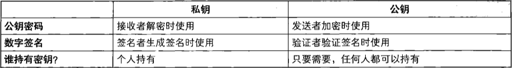
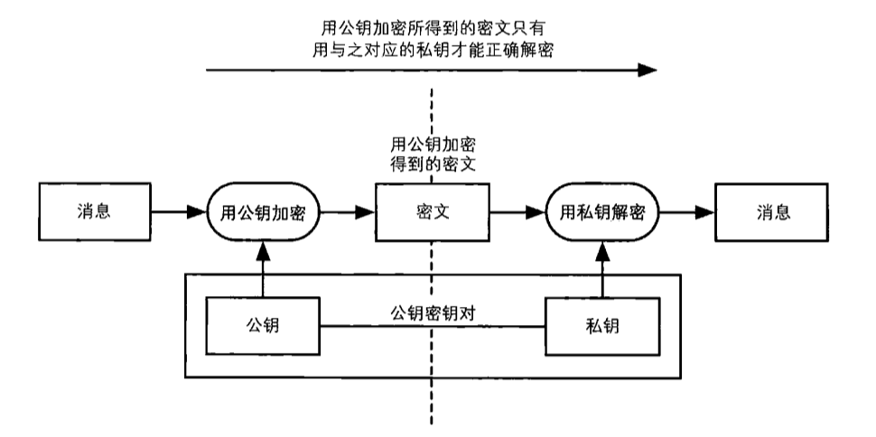
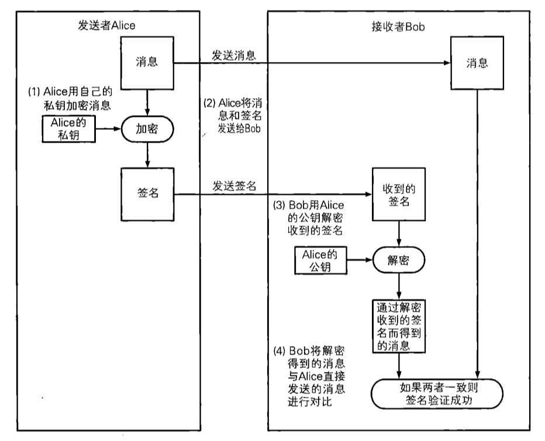
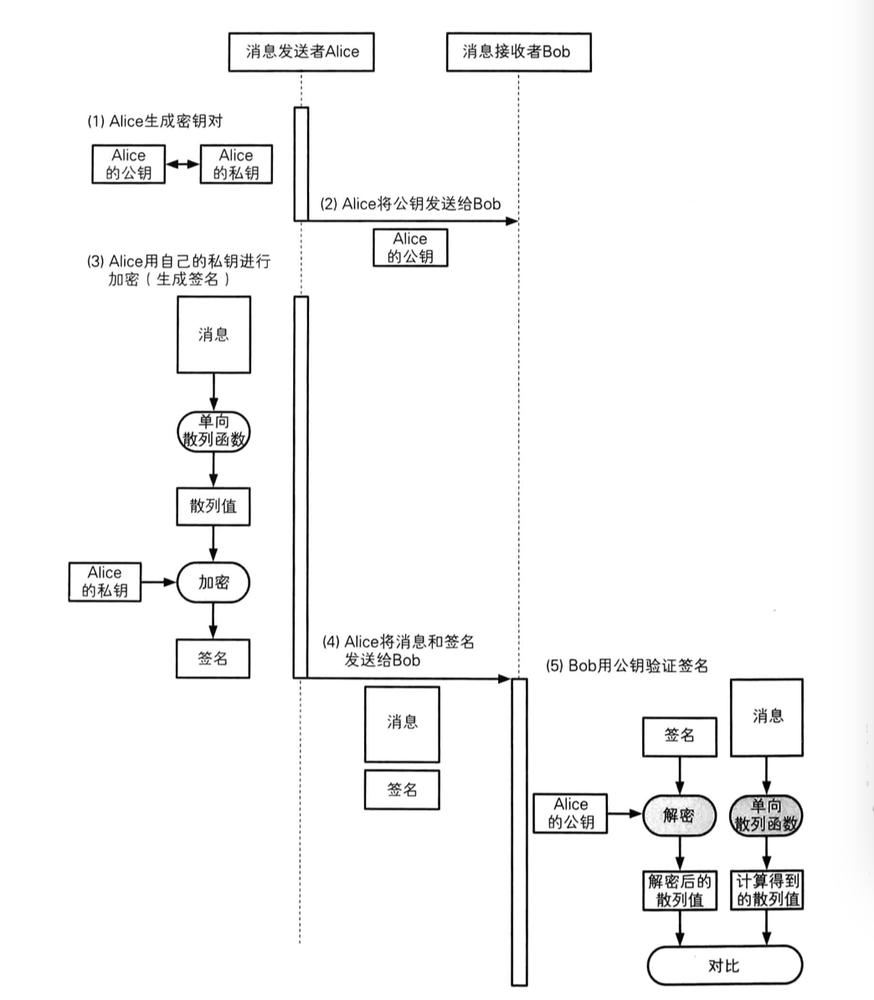
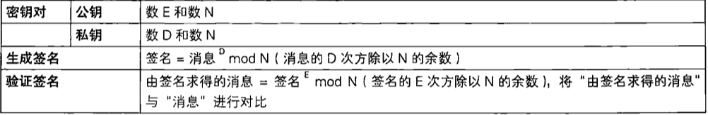
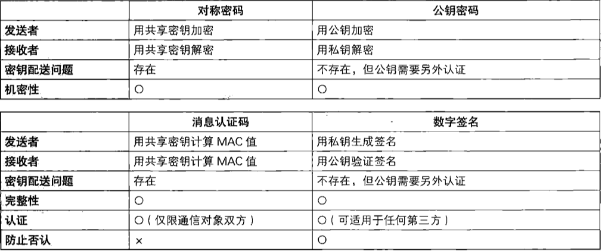

[TOC]

# 数字签名

##概述

使用数字签名可以识别篡改和伪装，还可以防止否认

* 消息认证码无法防止否认（因为**发送者和接收者共享一个密钥**）

假如接收者和发送者使用不同的密钥，A发送消息时，使用自己的私钥生成一个“签名”。相对的，接收者B则有一个与A的私钥不同的密钥对签名进行验证。使用B的密钥无法生成签名，但是可以对签名进行验证。这就是**数字签名**(digital signature)。


### 签名的生成和验证

在数字签名技术中，出现了下面两种行为：

* 生成消息签名的行为：发送者根据消息的内容计算数字签名的值
* 验证消息签名的行为：接收者（或第三方）验证该签名是否真正来自于期待的发送者。

**数字签名对签名密钥和验证密钥进行了区分，使用验证密钥无法生成签名。签名密钥只能由签名的人持有，而验证密钥则是任何需要验证签名的人都可以持有。**

###公钥密码与数字签名

实际上，数字签名和公钥密码有着非常紧密的联系。简而言之，数字签名就是通过将公钥密码“反过来用”的



公钥密码包括一个由公钥和私钥组成的密钥对，其中公钥用于加密，私钥用于解密。



数字签名中也同样会使用公钥和私钥组成的密钥对，用**私钥加密生成签名**，而用**公钥解密验证签名**。（RSA中正好是这样，其他算法中不一定有这种完全相反的关系）

公钥密码中，任何人都能进行加密；数字签名中，任何人都能验证签名。


## 数字签名的方法

有两种生成和验证数字签名的方法：

* 直接对消息签名的方法：实际上不会使用
* 对消息的散列值签名的方法：稍微复杂，但实用性高


### 直接对消息签名的方法

* A需要实现生成一个密钥对（公钥 + 私钥）
* A用自己的私钥对消息进行加密：密文就是A对这条消息的签名，由于只有A才持有私钥，因此除了A意外，其他任何人无法生成相同的签名
* A将消息和签名发给B
* B用A的公钥对收到的签名进行解密
* B将签名解密后得到的消息与A直接发送的消息进行对比。




### 对消息的散列值签名

* A用单向散列函数计算消息的散列值
* A用自己的私钥对散列值进行加密
* A将消息和签名发送给B
* B用A的公钥对收到的签名进行解密
* B将签名解密后得到的散列值与A直接发送的消息的散列值进行对比




* 数字签名可以被复制，但并不意味着签名没有意义，因为**重要的是特定的签名者与特定的消息绑定在一起**，签名是不是原件并不重要。
* 签名之后也可以对消息和签名进行修改，但修改之后，验证签名就会失败，进行验证的人就能够发现这一修改行为。数字签名的**目的不是防止修改，而是识别修改**。
* 签名不能重复使用：因为签名和消息有对应关系，消息不同对应的签名也不同，将对A的签名附加在B上，验证签名就会失败。
* 防止否认：防止否认与“谁持有密钥”这一问题密切相关。在消息认证码中，密钥由发送者和接收者共同持有，因此双方都能计算MAC值；而在数字签名中，密钥只有发送者持有。当然，如果发送者说“我的私钥被人窃取了”，也可以进行否认，这个问题会在第10章进行讨论


## 数字签名应用实例

（1）安全信息公告：一些信息安全的组织会在网站上发布一些关于安全漏洞的警告，信息发布是为了让更多人知道，但必须排除有人恶意伪装成该组织来发布假消息，这时可以使用数字签名：即该组织对警告信息施加数字签名。此时不加密消息，这种对明文进行的签名，称为**明文签名**


（2）软件下载：为了判断所下载的软件是否可以安全运行，软件的作者可以对软件加上数字签名，而我们只要在下载之后验证数字签名，即可判断软件是否被恶意篡改过


（3）公钥证书：在验证数字签名是，需要合法的公钥，我们可以将公钥当作消息，对它签名。这称为**公钥证书**。


（4）SSL/TLS在认证服务器身份是否合法时会使用服务器证书，它就是加上了数字签名的服务器公钥。相对地，服务器为了对客户端进行认证也会使用客户端证书，第14章会介绍SSL/TLS


## RSA签名




### RSA签名例子

使用公钥密码那一章例子中的公钥和私钥

```
公钥：E = 5；N = 323

私钥：D = 29；N = 323
```

假设我们对123这个消息进行签名


* 生成签名

(消息^D) mod N = (123^29) mod 323 = 157

向接收者发送的内容为

（消息，签名）= （123，157）

* 验证签名

接收者收到的内容为：

（消息，签名）= （123，157）

我们使用公钥（E,N）= (5,323)来计算签名求得的消息

(签名^E) mod N = (157^5) mod 323 = 123

因此验证成功


### 其他的数字签名

* EIGamal方式：利用在mod N中求离散对数的困难度，可以用于公钥密码和数字签名
* DSA方式
* Rabin方式：利用在mod N中求平方根的困难度，可以用于公钥密码和数字签名


## 对数字签名的攻击

* 中间人攻击：针对公钥密码的中间人攻击在数字签名也同样存在
* 对单向散列函数的攻击：数字签名中所使用的单向散列函数必须有强抗碰撞行，否则攻击者就可以生成另外一条不同的消息，使其与签名所绑定的消息具有相同的散列值。
* 利用数字签名攻击公钥密码：签名 = (消息^D) mod N，这个公式和公钥密码中解密的操作是相同的，攻击者可以利用数字签名来破译密文。
* 其他攻击：暴力破解找私钥，对RSA的N进行质因数分解等


## 各种密码技术的对比




## 数字签名无法解决的问题

数字签名既可以识别出篡改和伪装，还可以防止否认。

然而，要正确使用数字，有一个大前提，那就是用于验证签名的**公钥必须属于真正的发送者**。

为了确认自己得到的公钥是否合法，我们需要使用证书。

