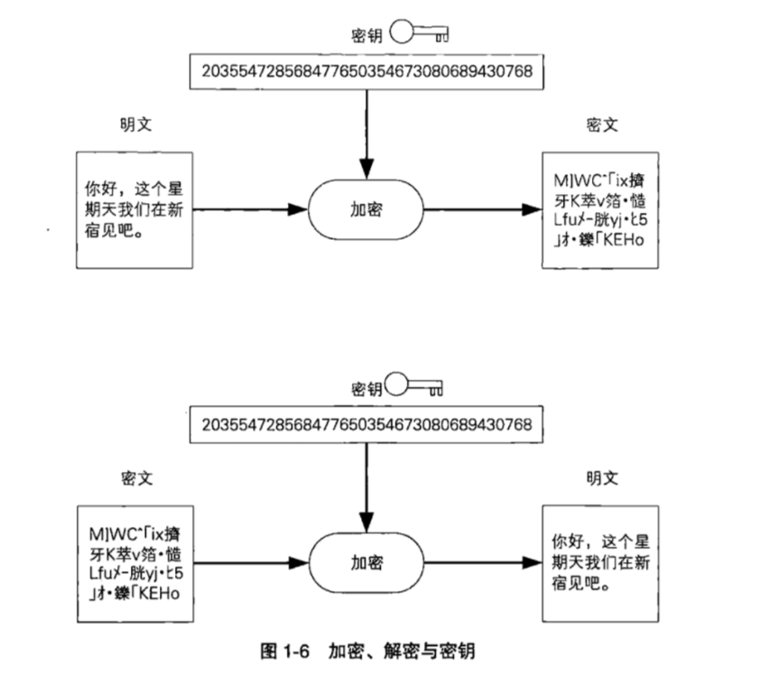
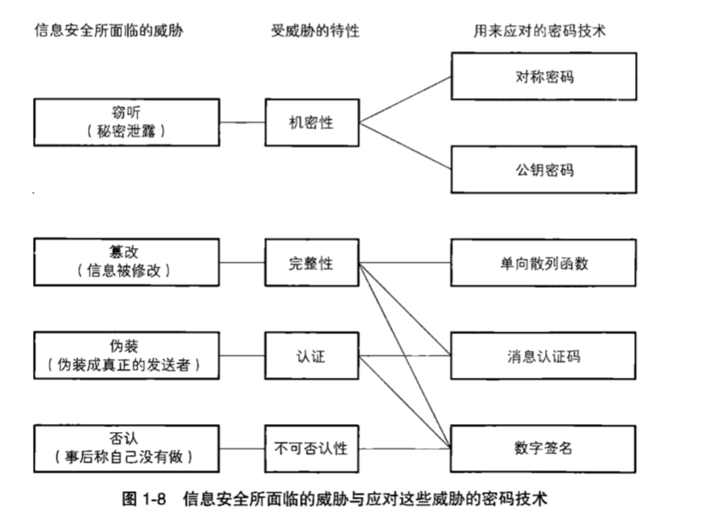

[TOC]

## 密码算法

加密算法：从明文生成秘文的步骤

解密算法：解密的步骤

密码算法 = 加密算法 + 解密算法

密钥：类似于现实生活中开锁需要钥匙，解密也需要钥匙即`密钥`

### 对称密码与公钥密码

对称密码：加密和解密时使用同一密钥

公钥密码：加密和解密使用不同密钥，也称为非对称密码

### 其他密码技术

认证：消息是否来自于期待的对象

### 隐写术和数字水印

密码隐藏消息内容，隐写术隐藏消息本身

### 密码学与信息安全常识

* 不要使用保密的密码算法
* 低强度的密码比不加密更危险
* 任何密码总有一天会破译
* 密码只是信息安全的一部分

