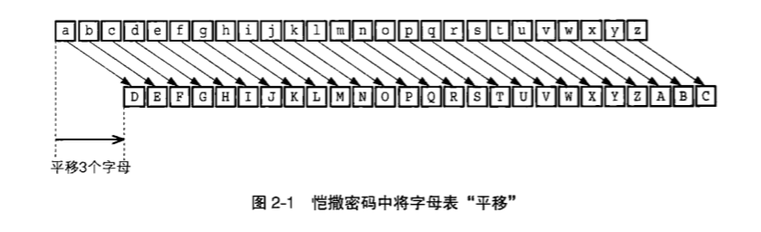
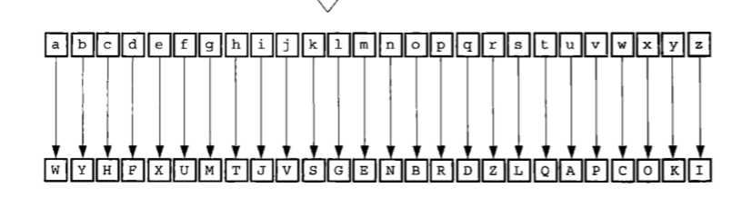

[TOC]

# 凯撒密码

通过将字母表“平移”来加密，密钥为平移的位数，这里是“3”



对“yoshiko”加密

```
y -> B
o -> R 
s -> V
h -> K
i -> L
k -> N
o -> R
```


反向平移3个单位即可解密。

`破译凯撒密码`：暴力破解&统计规律


# 简单替换密码

凯撒密码是简单替换密码的一种，密钥是：替换表



简单替换密码的密钥空间：26!，几乎不能暴力破解


# Enigma


# 密码算法与密钥分开

观察密码算法与密钥的组合可以发现：如果每次加密都产生一个新的密码算法：so weird。密码算法需要重复使用，但重复使用的过程中，被破译的概率也增大了，因此在算法中准备一个可变的部分：密钥，`解决了希望重复使用但重复使用会增加风险的问题`。