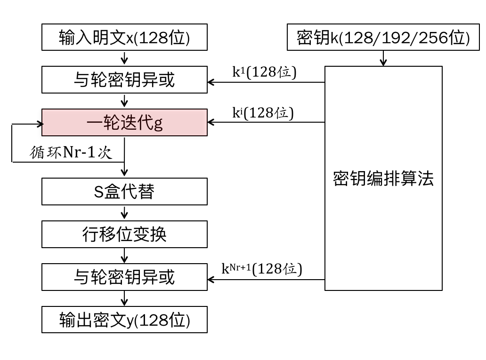
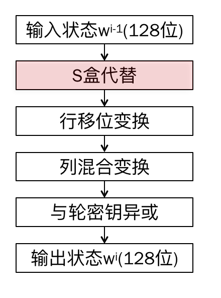
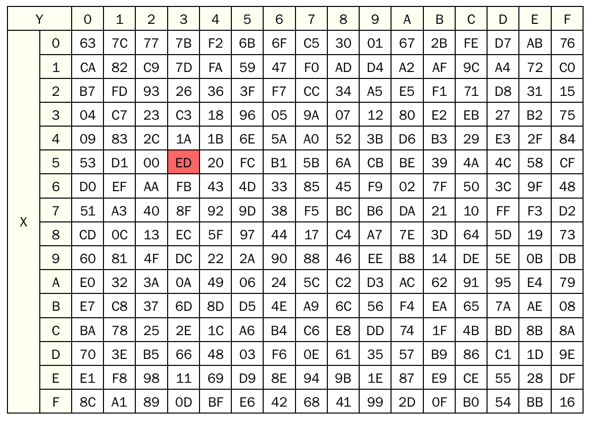
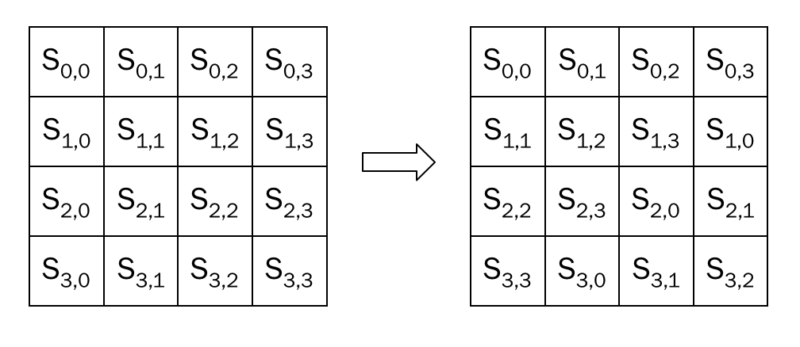
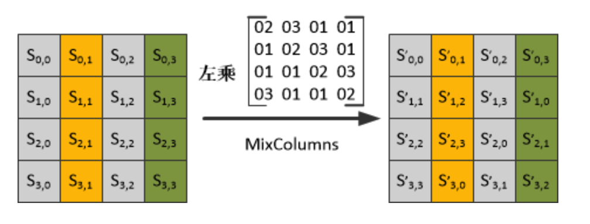
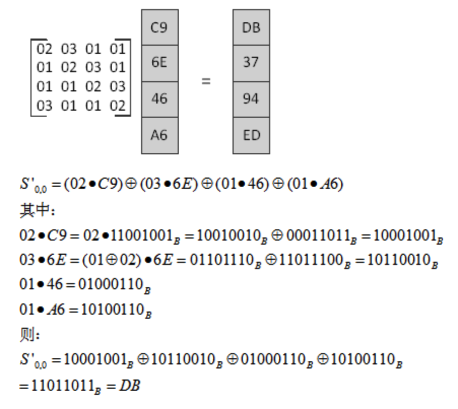

[TOC]

# AES算法

* AES算法采用了SPN结构，加密解密相似但不对称
* 能有效抵抗所有已知的攻击
* 没有发现弱密钥或补密钥
* 结构简单，运算速度快
* 支持128分组，支持128/192/256位密钥

## AES算法结构

##AES一轮迭代过程

### AES一轮迭代中的S盒代替

以字节为单位处理128位状态值，即将状态值看做16个字节，输入状态位53（16进制值），即X = 5，Y = 3，替换为。实际上AES算法不需要存储S盒，因为输入输出有固定代数关系（非线性关系），SubBytes算法

### 行移位变换

对状态矩阵的每一行进行循环左移，第i行循环左移i - 1个字节，用于提供算法的扩散性

### 列混合变换

1) 将某个字节所对应的值乘以2，其结果就是将该值的二进制位左移一位，如果原始值的最高位为1，则还需要将移位后的结果异或00011011；[1]

2) 乘法对加法满足分配率，例如：07·S0,0=(01⊕02⊕04)·S0,0= S0,0⊕(02·S0,0)(04·S0,0)

3) 此处的矩阵乘法与一般意义上矩阵的乘法有所不同，各个值在相加时使用的是模28加法（异或运算）。

## 轮密钥扩展算法

AES轮密钥扩展算法用到了S盒，这一点与DES不同

## AES的安全性

能抵御所有已公开的密码分析手段